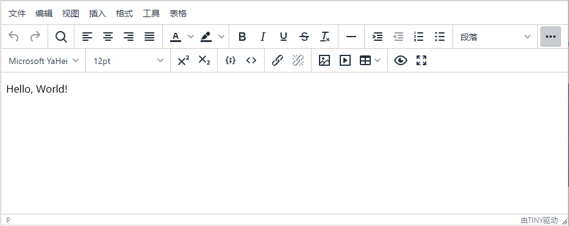

# vue2-tinymcy-editor

[](https://www.npmjs.com/package/vue2-tinymcy-editor) 


`vue2-tinymcy-editor` 是基于 `TinyMCE` 开发的 `Vue` 富文本编辑器组件。可以直接使用这个组件到你的项目中。如发现问题可以提到 issue。
## 预览图

## 如何使用

### 安装组件
```sh
yarn add vue2-tinymcy-editor
# or
npm install vue2-tinymcy-editor --save
```

### 全局引入
复制`node_modules/tinymce`目录下所有文件至`public`目录下
```bash
cp node_modules/tinymce/ public/
```
然后在 `public/index.html`页面全局引入`tinymce`
```html
<!DOCTYPE html>
<html lang="">
  <head>
    <meta charset="utf-8">
    <meta http-equiv="X-UA-Compatible" content="IE=edge">
    <meta name="viewport" content="width=device-width,initial-scale=1.0">
    <link rel="icon" href="<%= BASE_URL %>favicon.ico">
    <title><%= htmlWebpackPlugin.options.title %></title>
  </head>
  <body>
    <noscript>
      <strong>We're sorry but <%= htmlWebpackPlugin.options.title %> doesn't work properly without JavaScript enabled. Please enable it to continue.</strong>
    </noscript>
    <div id="app"></div>
    <!-- built files will be auto injected -->
     <script src="./tinymce/tinymce.min.js"></script><!-- tinymce -->
  </body>
</html>
```
**全局引入的本地化处理**

将`zh_CN.js`文件直接放到`public/tinymce/langs/`目录下就可以了，配置时加上`{language: 'zh_CN'}`的设置就能实现。

在vue组件中使用
```html
<template>
  <div id="app"> 
    <VueTinymce
      v-model="content" 
      :setting="setting" />
  </div>
</template>

<script>
import VueTinymce from 'vue2-tinymcy-editor'
export default {
  name: 'app',
  components: { VueTinymce },
  data(){
    return {
      content: '',
      setting: {
        menubar: false,
        toolbar: "undo redo | fullscreen | formatselect alignleft aligncenter alignright alignjustify | link unlink | numlist bullist | image media table | fontselect fontsizeselect forecolor backcolor | bold italic underline strikethrough | indent outdent | superscript subscript | removeformat |",
        toolbar_drawer: "sliding",
        quickbars_selection_toolbar: "removeformat | bold italic underline strikethrough | fontsizeselect forecolor backcolor",
        plugins: "link image media table lists fullscreen quickbars",
        language: 'zh_CN', //本地化设置
        height: 350
      }
    }
  }
}
</script>
```
### 按需引入
在 vue 组件中使用
```html
<template>
  <div id="app">
    <VueTinymce
      v-model="content" 
      :setting="setting" />
  </div>
</template>

<script>
import VueTinymce from 'vue2-tinymcy-editor'

//样式
import 'tinymce/skins/content/default/content.min.css'
import 'tinymce/skins/ui/oxide/skin.min.css'
import 'tinymce/skins/ui/oxide/content.min.css'

//主题
import 'tinymce/themes/silver'

//插件
import 'tinymce/plugins/link' //链接插件
import 'tinymce/plugins/image' //图片插件
import 'tinymce/plugins/media' //媒体插件
import 'tinymce/plugins/table' //表格插件
import 'tinymce/plugins/lists' //列表插件
import 'tinymce/plugins/quickbars' //快速栏插件
import 'tinymce/plugins/fullscreen' //全屏插件

// 注：5.3.x版本需要额外引进图标，没有所有按钮就会显示not found
import 'tinymce/icons/default/icons'

// 本地化
import './utils/tinymce/langs/zh_CN.js'
export default {
  name: 'app',
  components: { VueTinymce },
  data(){
    return {
      content: '',
      setting: {
        menubar: false,
        toolbar: "undo redo | fullscreen | formatselect alignleft aligncenter alignright alignjustify | link unlink | numlist bullist | image media table | fontselect fontsizeselect forecolor backcolor | bold italic underline strikethrough | indent outdent | superscript subscript | removeformat |",
        toolbar_drawer: "sliding",
        quickbars_selection_toolbar: "removeformat | bold italic underline strikethrough | fontsizeselect forecolor backcolor",
        plugins: "link image media table lists fullscreen quickbars",
        language: 'zh_CN',
        height: 350
      }
    }
  }
}
</script>
```

## 属性说明

| 名称       | 描述                                                                                                                      |
|------------|---------------------------------------------------------------------------------------------------------------------------|
| `:content` | 类型`String`，作为文本内容传入编辑器，可以使用`v-model`实现双向绑定                                                       |
| `@change`  | 类型`Function`，编辑器中`Input` `Change` `Undo` `Redo` `ExecCommand` `KeyUp` `NodeChange`事件响应后触发的事件返回文本内容 |
| `:setting` | 类型`Object`，编辑器的设置，`setup`不建议在这设置                                                                         |
| `:setup`   | 类型`Function`, 常用与自定义编辑器处理，组件内部做了些处理，建议在这里添加自定义的代码                                    |

## 相关资料

TinyMCE 官方地址：[https://www.tinymce.com/](https://www.tinymce.com/)
TinyMCE 官方文档：[https://www.tiny.cloud/docs/](https://www.tiny.cloud/docs/)
TinyMCE 中文文档：[http://tinymce.ax-z.cn/](http://tinymce.ax-z.cn/)